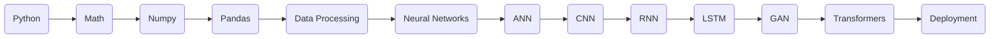

<div align="center">

# 🧠 Deep Learning Master Guide of DeepLearning-octo-dollop


### 🚀 Learn • Build • Train • Deploy


</div>

---

# 📑 Contents

- Introduction
- Learning Roadmap
- Mathematics
- Neural Network
- ANN
- CNN
- RNN
- LSTM
- GRU
- AutoEncoder
- GAN
- Transformer
- Attention
- Computer Vision
- NLP
- Transfer Learning
- TensorFlow
- PyTorch
- Deployment
- Projects

---

# 🌍 Deep Learning Overview

```text
Artificial Intelligence
        │
        ▼
Machine Learning
        │
        ▼
Deep Learning
        │
        ▼
Generative AI
        │
        ▼
Large Language Models
```

---

# 🎯 Learning Roadmap



---

# 📚 Mathematics

🟢 Linear Algebra

🟢 Calculus

🟢 Probability

🟢 Statistics

🟢 Optimization

---

# 🧠 Neural Network

```text
Input Layer
      │
Hidden Layer
      │
Hidden Layer
      │
Output Layer
```

Main Topics

- Neurons
- Weights
- Bias
- Activation Function
- Forward Propagation
- Backpropagation
- Gradient Descent

---

# 🔥 Activation Functions

| Function | Purpose |
|----------|----------|
| ReLU | Hidden Layer |
| Sigmoid | Binary Classification |
| Softmax | Multi-class Classification |
| Tanh | Deep Networks |
| Leaky ReLU | Avoid Dead Neurons |

---

# 🟣 ANN

✅ Regression

✅ Classification

✅ Feed Forward Network

✅ Backpropagation

---

# 🔵 CNN

```text
Image
   │
Convolution
   │
ReLU
   │
Pooling
   │
Flatten
   │
Dense
   │
Prediction
```

Topics

- Filters
- Feature Maps
- Padding
- Stride
- Pooling

Popular Models

- LeNet
- AlexNet
- VGG16
- ResNet
- EfficientNet

---

# 🟢 RNN

Topics

- Sequential Data
- Hidden State
- Time Series
- Text Processing

Applications

- Language Modeling
- Chatbots
- Speech Recognition

---

# 🟠 LSTM

Components

- Forget Gate
- Input Gate
- Cell State
- Output Gate

Applications

- NLP
- Forecasting
- Translation

---

# 🔴 GRU

- Update Gate
- Reset Gate
- Faster than LSTM
- Less Parameters

---

# 🟡 AutoEncoder

Architecture

```text
Input

↓

Encoder

↓

Latent Space

↓

Decoder

↓

Output
```

Applications

- Compression
- Denoising
- Feature Extraction

---

# 🟣 GAN

```text
Generator
      │
      ▼
Fake Image
      ▲
Discriminator
```

Applications

- AI Art
- Face Generation
- Image Enhancement

---

# 🌟 Transformer

Components

- Self Attention
- Multi Head Attention
- Positional Encoding
- Encoder
- Decoder

Popular Models

- BERT
- GPT
- T5
- Llama

---

# 👁️ Computer Vision

- Image Classification
- Object Detection
- Segmentation
- OCR
- Face Recognition

---

# 💬 NLP

- Tokenization
- Word Embedding
- Attention
- Transformers
- Language Models

---

# ⚙️ TensorFlow

- Sequential API
- Functional API
- Model Training
- Evaluation
- Saving Model

---

# 🔥 PyTorch

- Tensor
- Dataset
- DataLoader
- Autograd
- Training Loop

---


---

# 💼 Deep Learning Projects

| Beginner | Intermediate | Advanced |
|-----------|--------------|-----------|
| MNIST | CIFAR-10 | Image Captioning |
| Fashion MNIST | Cat vs Dog | GAN |
| House Price | Sentiment Analysis | Transformer |
| Iris | Face Recognition | LLM |

# 📦 Folder Structure

```text
Deep-Learning
│
├── 01_ANN_Implementation
├── 02_CNN_Implementation
├── 03_RNN_Implementation
├── 04_LSTM
├── 05_GRU
├── 06_AutoEncoder
├── 07_GAN
├── 08_Transformers
├── 09_NLP
├── 10_ComputerVision
├── notebooks
├── datasets
├── models
├── deployment
└── README.md
```

---

# ⭐ Learning Progress

🟩 Python

🟩 Mathematics

🟩 ANN

🟩 CNN

🟩 RNN

🟩 LSTM

🟩 GAN

🟩 Transformers

🟩 TensorFlow

🟩 PyTorch

🟩 Deployment

---

<div align="center">

# 🎉 Happy Deep Learning


Made with ❤️ for Deep Learning Learners

</div>
